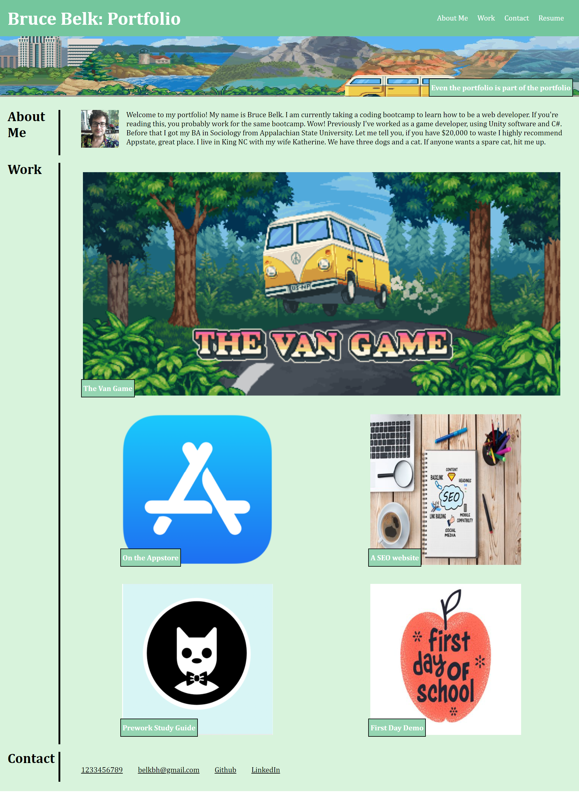

# Portfolio Project

## Table of contents
1. [Description](#description)
2. [Visuals](#visuals)

## Description
This is a simple webpage with my portfolio. It contains an "About Me" section, a "Work" section with multiple images and links, a "Contact" section with links, and a link to my resume.

[Link to live site](https://bbelk.github.io/portfolio-project/) 

## Visuals
